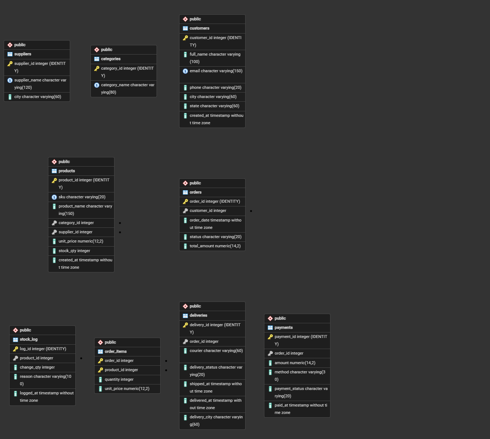

# Portfolio 1: Database Design and Modelling

## Case study
**MafixxStores**, an e-commerce platform. Customers browse products, place orders, pay and receive deliveries.
- **Users:** customers, sales staff, inventory managers, finance team, analysts
- **Major data:** customers, products, categories, suppliers, orders, order items, payments, deliveries, stock log
- **Key operations:** add products, place orders, update stock, process payments, track delivery
- **Starting point:** the owner's MySQL Workbench EER model (`MafixxStores.mwb.bak`). I reviewed and corrected it in `00_baseline_model_review.md`.

Data is synthetic (generated by `data/generate_data.py`).

## ER diagram

Source: `erd.mmd`. The diagram has 9 entities.

## Relational schema
Full definition: `01_schema.sql`

| Table | Primary key | Foreign keys |
|---|---|---|
| customers | customer_id | - |
| categories | category_id | - |
| suppliers | supplier_id | - |
| products | product_id | category_id, supplier_id |
| orders | order_id | customer_id |
| order_items | (order_id, product_id) | order_id, product_id |
| payments | payment_id | order_id (unique) |
| deliveries | delivery_id | order_id (unique) |
| stock_log | log_id | product_id |

**Relationships:** customer to orders is 1:many. Orders to products is many:many, resolved by `order_items`. Category and supplier to products are 1:many. Order to payment is 1:1. Order to delivery is 1:0..1.

## Keys and constraints
- **Primary keys** on every table, and a **composite key** on `order_items`.
- **Foreign keys** stop orphan rows, such as an order with no customer.
- **UNIQUE:** `customers.email`, `products.sku`, `payments.order_id`, `deliveries.order_id`.
- **NOT NULL** on required fields.
- **CHECK:** `unit_price > 0`, `stock_qty >= 0`, `quantity > 0`, valid status and payment method values, and `delivered_at >= shipped_at`.

## Normalisation
**Unnormalised start:** one sheet `OrderSheet(order_id, customer_name, customer_email, customer_city, product_name, category, supplier, quantity, price, payment_method, courier)`. Customer and product details repeat on every row, which causes update, insert and delete anomalies.
- **1NF:** one value per cell. Repeating products became rows in `order_items`.
- **2NF:** product details depend only on `product_id` and order details only on `order_id`, so they sit in their own tables.
- **3NF:** customer city and email depend on `customer_id`, not `order_id`. Category and supplier names depend on their own IDs. Each has its own table.
- **Deliberate denormalisation:** `order_items.unit_price` keeps the price at purchase time, and